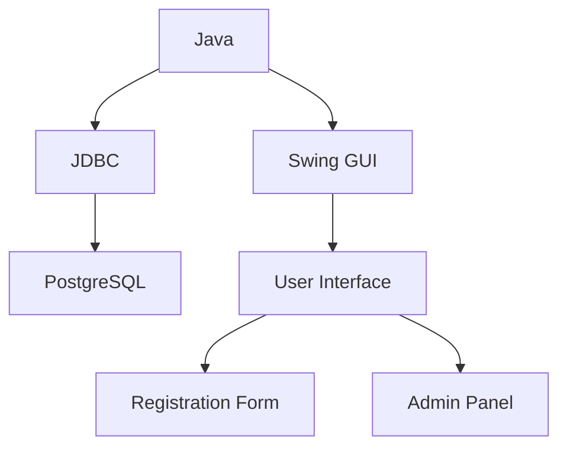
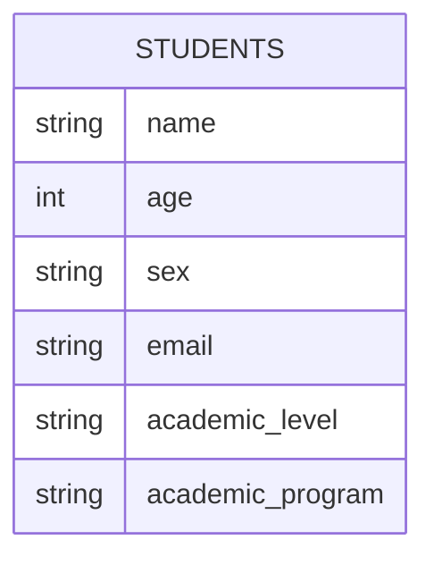

# 🎓 Student Registration System


<div align="center">

```ascii
+------------------------+
|      Welcome to        |
| Student Registration   |
|        System         |
+------------------------+
        |      |
    [Register] [Admin]
```

</div>

## 📚 Table of Contents
- [Overview](#-overview)
- [Features](#-features)
- [Technology Stack](#-technology-stack)
- [System Architecture](#-system-architecture)
- [Installation](#-installation)
- [Usage Guide](#-usage-guide)
- [Database Schema](#-database-schema)
- [Security Features](#-security-features)
- [Future Enhancements](#-future-enhancements)
- [Contributing](#-contributing)

## 🌟 Overview
A comprehensive Java-based Student Registration System featuring a user-friendly Swing GUI interface and PostgreSQL database integration. Designed to streamline the student registration process across multiple academic levels with real-time program selection and administrative oversight.

## 🚀 Features

### 🎯 Core Functionality
- **Student Registration Form**
  - Personal Information Capture
  - Academic Level Selection
  - Dynamic Program Assignment
  - Consent Management

### 📊 Academic Programs

<details>
<summary>Senior High School (Grades 11-12)</summary>

- 💻 ICT (Information and Communications Technology)
- 🔬 STEM (Science, Technology, Engineering, and Mathematics)
- 📊 ABM (Accountancy, Business, and Management)
- 📚 HUMSS (Humanities and Social Sciences)
- 🎓 GAS (General Academic Strand)
</details>

<details>
<summary>Undergraduate Studies</summary>

- 🖥️ BSCpE (Computer Engineering)
- 🏗️ BSCE (Civil Engineering)
- 📡 BSECE (Electronics and Communications)
- ⚙️ BSME (Mechanical Engineering)
- ⚡ BSEE (Electrical Engineering)
- 🌐 BSSA (System Administration)
</details>

<details>
<summary>Graduate Studies</summary>

- 🎓 Master's Programs in:
  - Computer Engineering
  - Civil Engineering
  - Electronics Engineering
  - Mechanical Engineering
  - Electrical Engineering
  - System Administration
</details>

## 💻 Technology Stack


## 🏗 System Architecture
```
StudentRegistration/
├── src/
│   └── database/
│       └── RegistrationForm.java
├── lib/
│   └── postgresql-jdbc.jar
├── docs/
│   └── README.md
└── database/
    └── schema.sql
```

## 🔧 Installation

1. **Database Setup**
```sql
CREATE TABLE students (
    name VARCHAR(100),
    age INTEGER,
    sex VARCHAR(10),
    email VARCHAR(100),
    academic_level VARCHAR(50),
    academic_program VARCHAR(50)
);
```

2. **Configuration**
```properties
DB_HOST=public.johnpaul
DB_PORT=5432
DB_NAME=postgres
DB_USER=postgres
DB_PASS=johnpaul
```

3. **Compilation & Execution**
```bash
javac RegistrationForm.java
java RegistrationForm
```

## 📖 Usage Guide

### 👨‍🎓 Student Registration
1. Launch the application
2. Fill in personal details
3. Select academic level
4. Choose appropriate program
5. Confirm registration

### 👨‍💼 Administrative Access
1. Click "ADMIN LOG-IN"
2. Enter credentials
   ```
   Default Password: password
   ```
3. View student records
4. Manage registrations

## 🗄 Database Schema


## 🔐 Security Features
- ✅ Password-protected admin access
- ✅ Input validation
- ✅ Data integrity checks
- ✅ Consent verification

## 🚀 Future Enhancements
- [ ] Implement password hashing
- [ ] Add email verification
- [ ] Create student dashboard
- [ ] Enable bulk registration
- [ ] Add reporting features

## 🤝 Contributing
Contributions are welcome! Please feel free to submit a Pull Request.

---

<div align="center">

**Made with ❤️ by [Soompa911](https://github.com/Soompa911)**

</div>
